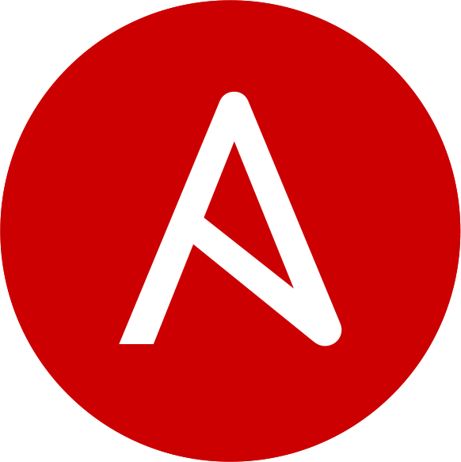

#

Herzlich Willkommen zum **Ansible Hackathon Vol.1**!

Wir wollen mit euch Use-Cases bearbeiten, welche wir auch häufig bei unseren Kunden antreffen und uns dabei insbesondere auf die weniger häufig verwendeten Features der Ansible Automation Platform fokussieren.

<figure markdown="span">
  [{ width="300" }](https://docs.ansible.com/){ target=_blank } { width="250" }
  [{ width="300" }](https://docs.ansible.com/){ target=_blank } { width="250" }
  <figcaption></figcaption>
</figure>

Der Hackathon steht im Zeichen eines **freundlichen Wettkampfs**, zwei Teams treten gegeneinander an und bearbeiten jeweils einen eigenen Use-Case.

     &nbsp; &nbsp; &nbsp; &nbsp;
     &nbsp; &nbsp; &nbsp; &nbsp;
    

Diese Dokumentation dient zum einen der Beschreibung der beiden Use-Cases, als auch zur Dokumentation der Umsetzung.
