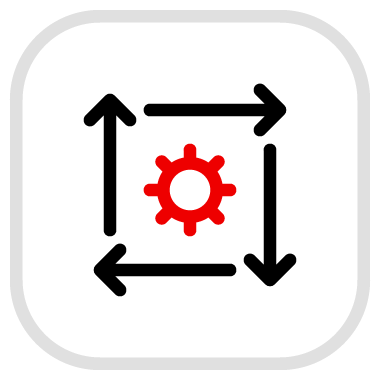
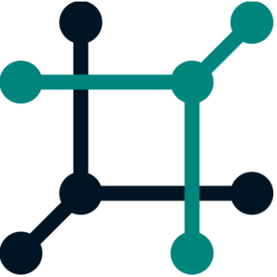
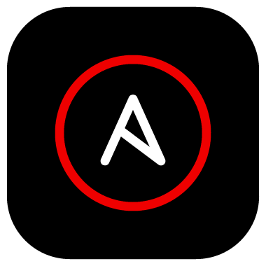

# EDA mit Netbox, AAP und Openshift

[{ width="140" }](https://ansible.readthedocs.io/projects/rulebook/en/latest/){ target=_blank }   [{ width="140" }](https://demo.netbox.dev/){ target=_blank }   [{ width="140" }](https://galaxy.ansible.com/ui/repo/published/infra/aap_configuration/){ target=_blank }   [{ width="140" }](https://galaxy.ansible.com/ui/repo/published/infra/aap_configuration/){ target=_blank }   [{ width="140" }](https://galaxy.ansible.com/ui/repo/published/infra/aap_configuration/){ target=_blank }

## Übersicht

In diesem Use-Case soll mit Event-Driven Ansible auf Events in der Netbox reagiert werden, bei Anlage eines VM Objekts soll automatisiert eine virtuelle Maschine über OpenShift Virtualization im OpenShift Cluster erstellt werden. Anschließend soll auf der virtuellen Maschine noch ein Webserver konfiguriert werden.  
Folgende Tools sollen hier bei zum Einsatz kommen:

* Single Source of Truth Netbox
* SCM nach Wahl
* Ansible Automation Platform
* OpenShift / OpenShift Virtualization
* Event-Driven Ansible
* Ansible Navigator
* Ansible Builder v3
* Execution Environment (default oder custom)

!!! success "Ziel"
    Die Playbooks befinden sich in einem SCM, der Usecase ist vollautomatisiert und nach Doku Vorgaben zu beschreiben.

## Vorgehen

* [x] **Step 1**  
    Es sollen mehrere simple Device Objekte, ohne viel Individualisierung, in der Netbox angelegt werden. Die Anlage, der zu erstellende Objekte, kann durch ein Playbook mit Hilfe der Netbox Collection erfolgen. Zur Orientierung gibt es auf Github vordefinierte Device Types GitHub

    !!! tip
        Man kann alle Objektdaten des Inventory Plugin über ansible-inventory anzeigen.

* [x] **Step 2**  
    Über einen Webhook, aus der Netbox, soll ein Playbook für die Erstellung eines Containers oder VM getriggert werden. Hier zu werden alle Daten (IP, Hostname usw.) über ein dynamisches Inventory, aus der Netbox verwendet.

* [x] **Step 3**  
    Event-Driven Automation Rulebook erstellen und auf ein beliebiges Event hören z.B. Prozess oder Änderung des Netboxobjekt. Durch das getriggerte Event wird ein Playbook ausgeführt und der Container oder die VM repariert. Hierzu kann der Container oder die VM auch einfach gelöscht und neu erstellt werden. Alles soll nach den Tests über die AAP 2.5 funktionieren.

* [x] **Step 4**  
    In der VM soll *automatisiert* ein Webserver installiert werden, mit der Dokumentation des Projekts. Es kann das GitHub Projekt des Hackathon verwendet werden und um die Dokumentation erweitert werden.

    !!! abstract "Tipps zum Deployment der Dokumentation"

        Die folgenden Schritte sind für ein *RHEL8*-System zu befolgen:

        :one: Webserver-Paket `httpd` installieren  
        :two: Git-Paket `git` installieren  
        :three: Projekt per HTTPS klonen: `https://github.com/TimGrt/Ansible-Hackathon.git`  
        :four: Notwendige Python-Version `python3.12` und Python-Paket-Manager `python3.12-pip` installieren  
        :five: Python-Dependencies `requirements.txt`des Projekts installieren (passenden Paketmanager auswählen!)  
        :six: MkDocs Projekt bauen: `python3.12 -m mkdocs build --site-dir /var/www/html`  
        :seven: Webserver starten  

        !!! success
            Das Playbook soll natürlich *idempotent* sein!

        ??? example "Lokal testen mit Molecule"

            Die oben beschriebenen Schritte können auch lokal mit *Molecule* getestet werden, nutzt dabei die Beschreibung aus dem [Best Practice Guide](){ target=_blank }.  
            Ein passender Test-Container (UBI8 Init-Container, verhält sich sehr ähnlich zu RHEL8-VM) ist hier zu finden: [ghcr.io/timgrt/rhel8-molecule-test-image:main](https://github.com/TimGrt/rhel8-molecule-test-image/pkgs/container/rhel8-molecule-test-image){ target=_blank }

## Links

Einige hilfreiche Tipps findet ihr hier:

* [netbox-community Devicetype-library documentation](https://github.com/netbox-community/devicetype-library/tree/master){ target=_blank }
* [Ansible Builder documentation ](https://github.com/ansible/ansible-builder){ target=_blank }
* [Ansible Navigator documentation](https://github.com/ansible/ansible-navigator){ target=_blank }
* [Event-Driven Ansible documentation](https://github.com/ansible/event-driven-ansible){ target=_blank }
